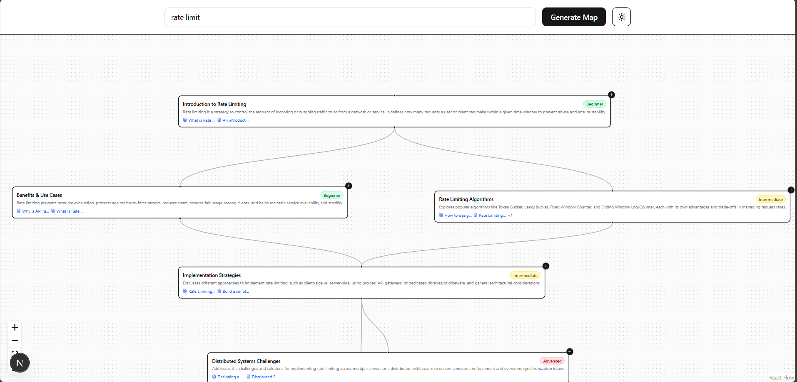

# Interactive Map - Interactive Learning Path Generator with Links to resources

An interactive learning map that generates visual learning paths for any topic using AI. Built with Next.js, React Flow, and Google's Gemini AI.

Learn Map Screenshot


## Features

- Generate interactive learning paths for any topic
- AI-powered content generation using Google Gemini
- Beautiful, responsive UI with dark/light mode (Controls component from ReactFlow theme issue)
- Zoom and pan functionality for exploring complex maps
- Mobile-friendly design with touch support
- Expandable nodes to dive deeper into subtopics (beta)

## Tech Stack

- **Frontend**: Next.js, React, TypeScript
- **UI**: Tailwind CSS, Shadcn UI (Lucide-react for icons)
- **Visualization**: React Flow
- **AI**: Google Gemini API
- **Layout**: Dagre for automatic graph layout

## Getting Started

### Prerequisites

- Node.js 18+ and pnpm/yarn
- Google Gemini API key

### Installation

1. Clone the repository:
   ```bash
   git clone https://github.com/bikash1376/Interactive-map
   cd interactive-map
   ```

2. Install dependencies:
   ```bash
   pnpm install
   # or
   yarn install
   ```

3. Create a `.env` file in the root directory and add your Google Gemini API key:
   ```
   GOOGLE_API_KEY=your_api_key_here
   ```

4. Run the development server:
   ```bash
   pnpm run dev
   # or
   yarn dev
   ```

5. Open [http://localhost:3000](http://localhost:3000) in your browser.

## API Usage

The application uses Google's Gemini AI to generate learning maps. The API is called through Next.js API routes.

### API Endpoints

- `POST /api/generate-map` - Generates a learning map for a given topic
  - Request body: `{ "topic": "Your topic here" }`
  - Response: JSON object containing nodes and edges for the learning map

- `GET /api/health` - Health check endpoint
  - Response: `{ "message": "✅API is fine" }`

### Environment Variables

- `GOOGLE_API_KEY`: Your Google Gemini API key (required)

## How It Works

1. **Map Generation**: When you enter a topic, the app sends a request to the Gemini API with a carefully crafted prompt to generate a structured learning path.

2. **Data Processing**: The response is processed to create nodes (learning topics) and edges (connections between topics).

3. **Visualization**: The learning map is rendered using React Flow, with automatic layout handled by the Dagre library.

4. **Interaction**: Users can:
   - Pan and zoom the map
   - Click on nodes to see details
   - Expand nodes to explore subtopics
   - Toggle between light and dark mode

## Project Structure

```
learn-map/
├── app/
│   ├── api/
│   │   ├── generate-map/  # API route for generating learning maps
│   │   └── health/        # Health check endpoint
│   └── page.tsx           # Main page component
├── components/
│   ├── ReactFlowMap.tsx   # Main map component
│   └── ui/                # Shadcn UI components
├── public/                # Static assets
└── styles/                # Global styles
```

## Contributing

Contributions are welcome! Please feel free to submit a Pull Request.

1. Fork the repository
2. Create your feature branch (`git checkout -b feature/amazing-feature`)
3. Commit your changes (`git commit -m 'Add some amazing feature'`)
4. Push to the branch (`git push origin feature/amazing-feature`)
5. Open a Pull Request

## Acknowledgements

- [React Flow](https://reactflow.dev/) for the interactive graph visualization
- [Shadcn UI](https://ui.shadcn.com/) for beautiful, accessible components
- [Google Gemini](https://ai.google.dev/) for AI-powered content generation
- [Dagre](https://github.com/dagrejs/dagre) for automatic graph layout
